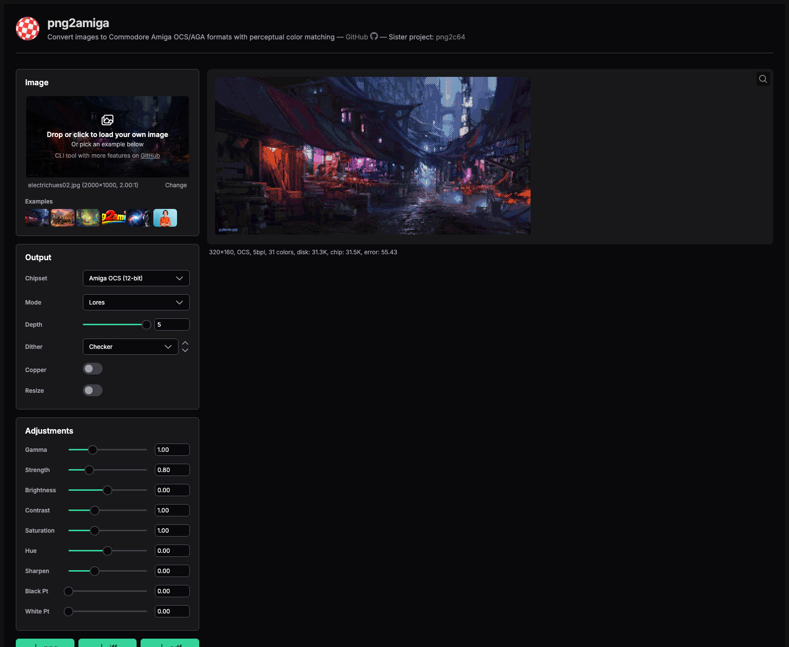
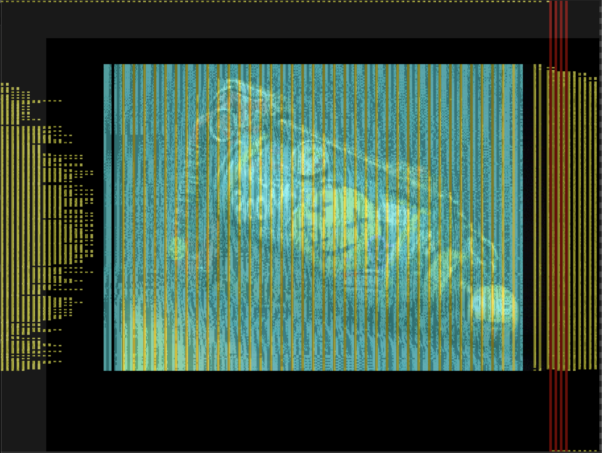
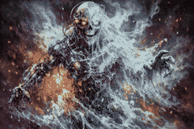

# png2amiga

[](LICENSE)
[](https://www.png2amiga.app)
[](https://github.com/tinic/png2amiga)
[](https://en.cppreference.com/w/cpp/26)

**Open-source** PNG/JPEG/WebP → Commodore Amiga, Atari ST/STE,
IBM PC (CGA / EGA / VGA), Commodore 64, Sega Genesis, and SNES Mode 7
image converter. Supports OCS/AGA bitplane, HAM6/HAM8, EHB, and
**sliced-HAM (SHAM) via copper palettes** with perceptual OKLab color
matching. Writes IFF ILBM, Degas `.PI1`/`.PI2`/`.PI3`, C64 `.prg` /
`.koa` / `.hir`, Genesis SGDK headers, SNES tile/tilemap `.bin`, C
headers, raw bitplanes, and standalone AmigaOS viewer `.cpp` source.
The bundled `build-amiga.sh` wrapper runs the included
`m68k-amiga-elf-gcc` + `exe2adf` toolchain to turn the `.cpp` into a
runnable `.exe` and bootable `.adf`. DOS-mode `.c` output compiles
with `ia16-elf-gcc` into a 16-bit real-mode viewer.

**[Try it in your browser at png2amiga.app](https://www.png2amiga.app)** —
live preview via WebAssembly, server-side compile to Amiga executables.

[](https://www.png2amiga.app)

Aimed at retro-platform asset pipelines (Amiga / Atari / IBM PC
demoscene, hobby AmigaOS games, MS-DOS coding). All color operations
use [OKLab](https://bottosson.github.io/posts/oklab/) perceptual color
space. Sister project to [png2c64](https://github.com/tinic/png2c64).

## Features

**Amiga modes**: Lores / Hires (+ interlace), HAM6 (OCS) + HAM8 (AGA)
with hires and/or interlace variants, EHB. 1–8 bitplanes within
chipset limits. Optional **sliced palette** (per-line copper swaps —
the same technique behind [Sliced HAM / SHAM](https://en.wikipedia.org/wiki/Hold-And-Modify#Sliced_HAM),
in use since 1989) and **strip palette** (additional mid-line swaps in
the active scanline, used in demoscene productions like Desire's
*Shuffling Around the Christmas Tree*).

**Atari modes**: STF Low/Medium/Hi, STE Low/Medium/Hi (9-bit palette
on STF, 12-bit on STE; ST-Hi is hardware-locked monochrome). Degas
Elite `.PI1`/`.PI2`/`.PI3` output.

**IBM PC modes**: CGA 320×200 / 640×200 / composite (NTSC artifact
colors), CGA text-mode glyph matching at 80x{200,100,50,25} and
40x{200,100} cell grids, EGA 320×200 / 640×200 / 640×350 (16 of the
64-color IrgbIRGB gamut), VGA Mode 13h (320×200, 256-color chunky),
Mode 10h (640×350, 16-color planar), Mode 12h (640×480, 16-color
planar). 16-bit DOS viewer `.c` output for `ia16-elf-gcc` compilation.

**Commodore 64**: VIC-II hires (320×200, 2 colors per 8×8 cell),
multicolor (160×200, 4 per 4×8), FLI / AFLI (per-row screen-RAM
swaps for more colors per cell), PETSCII (40×25 text-mode glyph
matching against the C64 character ROM), and custom-charset modes
(hires + multicolor) that build a per-image 256-glyph charset with
Hamming-distance pair merging when content overflows. Outputs
`.prg` / `.koa` / `.hir` for direct loading on real hardware.

**Sega Genesis / Mega Drive**: H32 (256×224) and H40 (320×224) with
optional Shadow/Highlight extension. 4 palette lines × 16 BGR333,
8×8 4bpp tiles + tilemap. SGDK `.h` / `.bin` output.

**SNES Mode 7**: 256-color BGR555-palette and 2048-color Direct
Color (BBGGGRRR) variants. Affine-transformable 8bpp BG1, ≤256
unique 8×8 tiles via greedy distance-merging when content overflows.

**Game Boy Advance**: Mode 3 (240×160 16bpp BGR555 direct), Mode 4
(240×160 8bpp + 256-color BGR555 palette), and Mode 5 (160×128 16bpp
BGR555 direct). PNG preview + devkitARM/grit-style `.h` header +
raw `.bin` (Mode 4 also writes a companion `.pal`).

**Palette quantizers**: GPU-accelerated parallel-restart Lloyd
k-means in OKLab on Apple GPU (default for AGA / VGA when Xcode's
Metal toolchain is available; mean ΔS2 +2.6..+3.4 vs pngquant on
DIV2K-100+Kodak-24 across K=8..256), OCS brute-force (histogram +
k-means over all 4096 OCS colors), PNN agglomerative (Ward's
linkage in OKLab — default for HAM AGA), and median-cut + k-means
refinement in OKLab (CPU fallback when Metal isn't available).

**Dithering**: 64 methods.

- **Error Diffusion** (19) — Floyd–Steinberg, Sierra-Lite, Atkinson,
  Jarvis, Stucki, Gilbert, Riemersma, DBS (slow); palette-aware
  planning: Optimal Checker, Optimal Line, Optimal Line-Checker,
  Tri-tone, Knoll, Yliluoma 1 (exhaustive) and Yliluoma 2 (greedy +
  luma-weighted variant); structure-aware: Structure-FS,
  Contrast-FS, Zhou–Fang.
- **Bayer** (14) — Bayer 2×2 / 4×4 / 8×8 / 3×3 / 5×5 / 6×6 / 7×7,
  non-square Bayer 4×2 and 2×4, plus the matrices Aseprite (old
  4×4), libcaca (3×3 and 6×6), Pegasus 8×8 shipped, and
  Cranley–Patterson rotated Bayer.
- **Halftone** (4) — Halftone 8×8, Diagonal Newspaper, Spiral 5×5,
  Clustered Dot.
- **Hatching** (9) — horizontal Lines 2 / 4 / 8 + Line Checker,
  vertical VLines 2 / 4 / 8 + VLine Checker, Crosshatch.
- **Pattern** (8) — Checker, Wide 2×4, Tall 4×2, Hexagonal 8×8 and
  5×5, Radial, Quasicrystal, Truchet.
- **Noise** (10) — Blue Noise, Void & Cluster, Cluster Noise,
  Niklasson 16×16 Fractal, IGN and IGN-triangle, R2 and
  R2-triangle, Value Noise, White Noise.

**HAM encoding**: DP beam search with a triple-pixel refinement pass
(default on) that catches the fringe-lag artifacts 1-pixel DP misses.
`--ham-fast` switches to the greedy encoder (~15× faster, ~0.04 dB
quality cost) for live preview or batch video processing.

**Output**: `.png` preview, `.iff` ILBM (Amiga), `.pi1`/`.pi2`/`.pi3`
Degas (Atari ST/STE), `.prg`/`.koa`/`.hir` (C64), `.bin` + `.h` (SNES
tile/tilemap, Genesis SGDK), `.h` C header, `.cpp` standalone viewer
source (Amiga) or `.c` (DOS, ia16-elf-gcc), `.raw` + `.pal` raw
bitplanes with palette. The `build-amiga.sh` helper compiles
`.cpp` → `.exe` → `.adf` via the bundled toolchain.

## Build

```bash
# Native CLI (requires GCC 15 for C++26)
cmake -B build -DCMAKE_C_COMPILER=gcc-15 -DCMAKE_CXX_COMPILER=g++-15 .
cmake --build build
ctest --test-dir build --output-on-failure

# WASM (requires Emscripten) — builds both the SIMD and scalar variants
emcmake cmake -B build-wasm -DCMAKE_BUILD_TYPE=Release .
cmake --build build-wasm --parallel

# Web frontend
cd web && npm install && npm run dev

# Production web bundle (writes to docs/)
./tools/build-web.sh
```

Pre-built Linux / macOS / Windows binaries are attached to each
[GitHub release](https://github.com/tinic/png2amiga/releases).

The x86-64 binaries need **AVX2** (Intel Haswell 2013+, AMD Zen 2017+).
On an older CPU, use `png2amiga-windows-x86_64-compat.exe` from the same
release — same features, somewhat slower. Building one on any platform:
`cmake -B build-compat -DPNG2AMIGA_BASELINE_SIMD=ON .`

## Usage

```bash
# Basic conversion
./build/png2amiga input.png output.iff
./build/png2amiga input.jpg output.png

# HAM8 on AGA (default — triple refinement, FS pre-dither, PNN palette)
./build/png2amiga --mode ham8 --chipset aga input.png output.iff

# HAM8 realtime / batch profile (greedy, ~15× faster)
./build/png2amiga --mode ham8 --chipset aga --ham-fast input.png output.png

# Sliced palette — per-line copper swaps (more colors per scanline).
./build/png2amiga --mode lores --depth 5 --sliced input.png output.iff
./build/png2amiga --mode ham6 --sliced input.png output.iff

# Strip palette — mid-line swaps inside the active scanline. DPF or EHB only.
# IFF has no chunk for mid-line MOVEs, so use .cpp (runnable AmigaOS viewer)
# or .h (data-only) instead.
./build/png2amiga --mode lores --dpf --strips input.png viewer.cpp
./build/png2amiga --mode ehb --strips input.png data.h

# HAM6 + sliced palette, multi-restart search (~4-5× slower, +0.5 to +2 dB PSNR)
./build/png2amiga --mode ham6 --sliced --best input.png output.iff

# Generate a bootable Amiga floppy that displays the image
./build/png2amiga --mode ham6 input.png viewer.cpp
./build-amiga.sh viewer.cpp viewer.adf

# Launch in fs-uae (A1200 by default)
./run-amiga.sh viewer.adf
./run-amiga.sh viewer.adf A500 ntsc

# Atari ST/STE
./build/png2amiga --mode stf-low input.png output.pi1
./build/png2amiga --mode ste-low input.png output.pi1

# IBM PC (CGA / EGA / VGA)
./build/png2amiga --mode vga-13h input.png output.png        # preview
./build/png2amiga --mode ega-320 input.png viewer.c          # 16-bit DOS viewer
./build/png2amiga --mode cga-320 --cga-palette p1-high \
    input.png output.png

# Commodore 64
./build/png2amiga --mode c64-multicolor input.png output.prg    # bootable .prg
./build/png2amiga --mode c64-petscii input.png output.png       # text-mode preview

# Sega Genesis (H40 + Shadow/Highlight, SGDK header)
./build/png2amiga --mode genesis-h40-sh input.png output.h

# SNES Mode 7 (256-color palette + tilemap + tile data)
./build/png2amiga --mode snes-mode7-256 input.png output.bin

# Game Boy Advance
./build/png2amiga --mode gba-mode3 input.png output.h          # 16bpp BGR555 bitmap header
./build/png2amiga --mode gba-mode4 input.png output.bin        # 8bpp indices + companion .pal
./build/png2amiga --mode gba-mode5 input.png output.png        # 160×128 preview
```

Run `./build/png2amiga --help` for the full flag reference.

## Amiga Modes

| Mode | Resolution | Max Depth | Colors | Notes |
|------|-----------|-----------|--------|-------|
| `lores` | 320px | OCS:5 AGA:8 | 2–256 | Square pixels |
| `lores-lace` | 320px | OCS:5 AGA:8 | 2–256 | Interlaced (wide pixels) |
| `hires` | 640px | OCS:4 AGA:8 | 2–256 | Tall pixels |
| `hires-lace` | 640px | OCS:4 AGA:8 | 2–256 | Interlaced (square pixels) |
| `ham6` (+ lace/hires variants) | 320/640px | 6 | 4096 | Hold-And-Modify (OCS) |
| `ham8` (+ lace/hires variants) | 320/640px | 8 | 16M | Hold-And-Modify (AGA) |
| `ehb` / `ehb-lace` | 320px | 6 | 64 | Extra Half-Brite |

## Atari Modes

| Mode | Resolution | Depth | Colors | Palette |
|------|-----------|-------|--------|---------|
| `stf-low` | 320×200 | 4 | 16 | 9-bit (512 colors) |
| `stf-med` | 640×200 | 2 | 4 | 9-bit (512 colors) |
| `stf-hi` / `ste-hi` | 640×400 | 1 | 2 (B/W) | hardware-locked monochrome |
| `ste-low` | 320×200 | 4 | 16 | 12-bit (4096 colors) |
| `ste-med` | 640×200 | 2 | 4 | 12-bit (4096 colors) |

## IBM PC Modes

| Mode | Resolution | Colors | Notes |
|------|-----------|--------|-------|
| `cga-320` | 320×200 | 4 | Fixed palettes (`--cga-palette p0-low/p0-high/p1-low/p1-high`) |
| `cga-640` | 640×200 | 2 | Monochrome |
| `cga-composite` | 320×200 | 16 | Reenigne NTSC chroma multiplexer; `--cga-composite-card old`/`new` |
| `cga-text80x{200,100,50,25}` / `cga-text40x{200,100}` | 80×N or 40×N cells | 16 fg × 16 bg | Glyph + attribute matching against the IBM CGA 8×8 font; all variants except 80×200 fit in 16 KB CGA VRAM |
| `ega-320` / `ega-640` / `ega-hi` | 320×200 / 640×200 / 640×350 | 16 of 64 | 4-plane IrgbIRGB gamut |
| `vga-13h` | 320×200 | 256 | 8bpp chunky, 18-bit DAC |
| `vga-10h` | 640×350 | 16 | 4-plane planar, 18-bit DAC |
| `vga-12h` | 640×480 | 16 | 4-plane planar, square pixels |

`--native-par` letterboxes/pillarboxes the source into the fixed DOS
buffer; the default is to stretch-fill.

## Game Boy Advance Modes

| Mode | Resolution | Colors | Notes |
|------|-----------|--------|-------|
| `gba-mode3` | 240×160 | 32768 | 16bpp BGR555 direct color (one word per pixel, no palette) |
| `gba-mode4` | 240×160 | 256 | 8bpp paletted + 256-entry BGR555 palette |
| `gba-mode5` | 160×128 | 32768 | 16bpp BGR555 direct color (smaller buffer, hardware-scaled) |

Output: PNG preview (always) + devkitARM/grit-style C header (`.h`,
`const unsigned short`/`const unsigned char` arrays with element-count
sizes) + raw `.bin` (Mode 4 also writes a companion `.pal` of 256 ×
u16 LE BGR555). Square pixels (PAR 1.0). `--native-par` letterboxes/
pillarboxes the source into the fixed LCD buffer; the default is to
stretch-fill.

## Thomson Modes

Thomson TO7/70 and TO8 (French micros). Channels use the EF9369 + TEA5114
gamma LUT (`intens[16]`, a non-uniform ramp — NOT nibble replication).

| Mode | Resolution | Colors | Notes |
|------|-----------|--------|-------|
| `thomson-to7-320x16` | 320×200 | 16 fixed | forme-couleur, 2 colors per 8×1-pixel cell, fixed TO7/70 palette |
| `thomson-to8-320x16` | 320×200 | 16 prog. | forme-couleur, programmable 16-from-4096 palette |
| `thomson-to8-160x16` | 160×200 | 16 prog. | 4bpp bitmap, no per-cell constraint |
| `thomson-to8-320x4` | 320×200 | 4 prog. | 2-bitplane bitmap |
| `thomson-to8-640x2` | 640×200 | 2 prog. | 1bpp bitmap |

The forme-couleur color byte uses the TO-series inverted-high-bits format
(round-trip-verified against the theodore emulator's `Decode320x16`).

## Commodore TED Modes

Commodore Plus/4 and C16 (TED video chip). Fixed 121-color palette
(luma 0–7 × chroma 0–15; chroma 0 = black at every luma).

| Mode | Resolution | Colors | Notes |
|------|-----------|--------|-------|
| `ted-hires` | 320×200 | 2 / 8×8 cell | hires (C64-hires-like) |
| `ted-multicolor` | 160×200 | 4 / 4×8 cell | multicolor: 2 global + 2 per-cell |

Thomson + TED: fixed-buffer modes, square pixels (PAR 1.0). Output: PNG
preview (always) + generic C header (`.h`: `const unsigned char` arrays
— Thomson `Couleur`/`Forme` or `PageA`/`PageB` + a 4-bit r/g/b `Palette`
for the TO8 modes; TED `Bitmap`/`Luma`/`Chroma` + `Bg0`/`Bg1` defines for
multicolor) + native-layout raw `.bin` (Thomson: pageA then pageB; TED:
bitmap, luma, chroma, then the two global bytes). The programmable TO8
modes also write a companion `.pal`. `--depth` / `--chipset` are no-ops;
reserve / lock / external-palette flags and `.iff` / viewer outputs are
rejected (fixed or auto-quantized palettes).

## Sliced palette (per-line copper swaps)

Add `--sliced` to any bitmap mode (lores, hires, EHB, HAM6, HAM8) to let
the Copper coprocessor rewrite palette registers in the horizontal blank
between every scanline. Each line displays with its own palette state,
and the planner picks per-line color swaps that minimize OKLab error
against the source row.

This is the same technique that's been used in Amiga demos and HAM
converters since the late 1980s — the [Wikipedia article on
HAM](https://en.wikipedia.org/wiki/Hold-And-Modify#Sliced_HAM) covers
the lineage as "Sliced HAM" / SHAM / dynamic HAM. On hires the same
trick is known as **Dynamic HiRes (DHIRES)** — copper-driven 16-color
palette swaps per scanline; `--mode hires --sliced` is png2amiga's
DHIRES path. The reference HAM encoder
[ham_convert](http://mrsebe.bplaced.net/blog/wordpress/?page_id=374)
and Leonard's [Brute Force Colors](https://arnaud-carre.github.io/2022-12-30-amiga-ham/)
both implement the per-line variant. png2amiga aims at the same target
with a perceptual error metric and applies the technique to indexed
modes too (lores, hires, EHB) rather than just HAM.

The encoder respects the real-hardware post-DDFSTOP DMA budget: **14
MOVE instructions per line** (one of the 15 copper slots is the per-line
WAIT). Safe static budget is 14 palette swaps on OCS (one MOVE per
change) and 3 on AGA (4 MOVEs per change worst-case under banked LOCT).
Auto-mode tries K+3, K+2, K+1 and picks the highest K whose worst-case
cost fits the budget — typically 6 swaps/line at depths 3–5 on AGA.

`--slice-changes N` overrides the budget; use if you want to experiment
with configurations that may exceed real hardware limits but still
display correctly on emulators.

`--best` runs a multi-restart sweep over jitter seeds, dither
strengths, and palette-diversity values, picking the trial with the
best result against `--best-metric` (SSIMULACRA2 by default). Available
on plain HAM6/HAM8, plain EHB, and any combination with sliced or
strip palette. Cost is ~20–30× the single-pass time on most modes
(HAM-CAP / strips can land closer to ~5×); typical gain is
+0.5 to +2 dB PSNR.

## Strip palette (mid-line swaps inside the active scanline)

`--strips` extends the sliced palette by issuing additional palette
MOVEs at fixed **mid-line** copper slots — so a single scanline can
display multiple palette banks across its width. Where the per-line
sliced palette gives "this row's 64 colors", strips gives "this strip's
64 colors", with strips on a 16-pixel grid. Strips ride on top of the
sliced base (each line opens with the sliced palette reload in hblank,
then mid-line swaps walk it through the visible region).

Mid-line copper register changes have been a demoscene staple for
decades — Shadow of the Beast (1989) used single-color bars, Spaceballs'
[State of the Art](https://www.pouet.net/prod.php?which=99) (1992)
pushed full mid-line palette manipulation, and recent productions like
Desire's [Shuffling Around the Christmas Tree](https://www.pouet.net/prod.php?which=90358)
(2021, code by Platon42) and [Copper Chunky](https://www.powerprograms.nl/amiga/copper-chunky.html)
by Jeroen Knoester (2021) showcase how dense the per-line copper traffic
can get. png2amiga's contribution is wiring this style of per-strip
palette change into a still-image converter on top of an OKLab
error-diffused dither.

Two strip modes:

* **DPF + strips** (`--mode lores --dpf --strips`) — OCS dual-playfield,
  3-plane PF2 (8 base colors). The 8 PF2 registers are unconditionally
  re-emitted in every line's hblank (~9 MOVEs, fixed) so mid-line swaps
  cannot leak state across lines. Up to 19 useful mid-line swaps per
  scanline; ~454 unique displayed colors per frame on a typical image.

* **EHB + strips** (`--mode ehb --strips`) — OCS Extra Half-Brite, 32
  base registers + 32 hardware-derived half-brites. Each base swap also
  updates the matching half-brite slot via the hardware DAC. Adaptive
  per-line hblank tracking keeps each line inside the 14-MOVE OCS hblank
  budget. ~1100+ unique displayed colors per frame.

Both modes are OCS-only, lores, no interlace. The planner runs 6
iterative refinement passes alternating index dither and mid-line swap
selection. Slot positions were calibrated empirically on real OCS
hardware via `--strips-probe` (see `src/strips.hpp`); the published
hardware budget is ~14 hblank MOVEs + ~20 visible-area MOVEs per line in
6-plane modes, and the calibrated slot tables sit comfortably within
that.



The vAmiga debug overlay shows one frame's copper list and bus usage:
every visible scanline runs a near-saturated MOVE stream through the
displayed area — each band of activity is one scanline's sliced-palette
reload in hblank plus ~19 mid-line swaps inside the visible area.

## Cross-fade between two images (`--fade-to`)

Encode one bitmap and morph its palette toward a second image at
runtime — joint k-means clusters every (source ⊕ target) slot together
so the same index buffer reproduces both stops. The emitted `.cpp`
viewer patches per-frame value tables on real hardware. Lores / hires
/ EHB only.



```
png2amiga --depth 5 --fade-to target.png source.png viewer.cpp
```

## How does it compare?

Source: `examples/makena.jpg` resized to 320×213 (Lanczos),
all encoders run with Floyd-Steinberg dither at their highest-quality
setting. Metrics: PSNR (sRGB byte distance) and SSIMULACRA2
(Cloudinary 2022 — perceptual, calibrated against human ratings;
30=low, 50=fair, 70=high quality).

**Palette precision asymmetry** — read this before comparing PSNR
columns. png2amiga's `lores d=5`, every `HAM6` row, and the
ham_convert / abc lores-d5 / ocs32 / HAM6 / SHAM6 entries all
operate on real Amiga OCS hardware: a **12-bit palette** (4 bits
per channel, 4096 colors total). The general-purpose quantizers
(pngquant, ImageMagick, Netpbm, ffmpeg, gifsicle, pngnq, didder)
quantize into **24-bit sRGB** (8 bits per channel, 16M colors).
That precision gap alone gives the 24-bit tools ~1 dB of "free"
PSNR — they can land on the optimum-MSE centroid; the Amiga-mode
encoders have to snap to the nearest 4-bit-per-channel grid point.

That's why some 32-color rows below show png2amiga's PSNR _behind_
pngquant's by ~1 dB while still leading perceptually (51.55 vs
51.14 SSIMULACRA2 — the 12-bit handicap costs PSNR but the 
OKLab + ocs-bruteforce quantizer still wins the eyeball test). And it's
why the 256-color tier is closer on PSNR: there both encoders
work in 24-bit (png2amiga's `--chipset aga` gates lift the OCS
snap).

png2amiga, ham_convert, and abc additionally reserve palette index 0
for black via their respective lock flags (`--lock-color0` /
`black_bkd` / `-forcecolor 0 000`). The general-purpose quantizers
don't expose a "pin one slot, quantize the rest" knob, so they're
free to spend the black-slot bit elsewhere — another small advantage
that doesn't move the rankings.

Row swatches group encodings by output color budget so PSNR/S2
columns can be compared apples-to-apples:
🟪 HAM6 (16-color base + per-pixel modify, ~4096 effective) ·
🟦 256 colors ·
🟩 EHB (32 base + 32 hardware half-brite, 64 effective) ·
🟧 32 colors.

|     | Encoder     | Mode                              | PSNR (dB) | SSIMULACRA2 | Time (s) |
|:---:|-------------|-----------------------------------|----------:|------------:|---------:|
| 🟦 | **png2amiga** | **lores d=8 AGA + best**       | 32.35     | **83.02**   |    15.04 |
| 🟦 | png2amiga   | lores d=8 AGA                     | 32.37     | 82.87       |     0.76 |
| 🟦 | pngquant    | libimagequant 256 (`--speed 1`)   | 33.61     | 80.13       |     0.06 |
| 🟦 | ffmpeg      | 256 (`palettegen`+FS)†            | 31.18     | 78.61       |     0.06 |
| 🟪 | png2amiga   | HAM6 + sliced + best              | 30.99     | 76.15       |    21.72 |
| 🟪 | png2amiga   | HAM6 + sliced                     | 30.50     | 75.60       |     0.25 |
| 🟪 | ham_convert | SHAM6 (`ham6_sliced`, `dither_fs`)| 31.81     | 74.82       |    20.18 |
| 🟪 | png2amiga   | HAM6 (no copper)                  | 30.22     | 72.94       |     0.19 |
| 🟪 | png2amiga   | HAM6 + best (no copper)           | 30.22     | 72.94       |     9.40 |
| 🟦 | Netpbm      | pnmquant 256 (`-floyd`)†          | 31.59     | 72.20       |     0.11 |
| 🟩 | png2amiga   | EHB + strips + best               | 29.39     | 71.60       |    18.55 |
| 🟪 | ham_convert | HAM6 q1 (fastest, `dither_fs`)    | 29.45     | 70.41       |     4.08 |
| 🟪 | ham_convert | HAM6 q7 (max quality, `dither_fs`)| 30.04     | 70.05       |    38.30 |
| 🟦 | gifsicle    | 256 (`--dither floyd-steinberg`)† | 32.94     | 69.47       |     0.02 |
| 🟦 | didder      | 256 (`mmcq`+FS edm serpentine)†   | 28.27     | 68.52       |     0.13 |
| 🟦 | ImageMagick | 256 (`-dither FS`)†               | 30.69     | 66.85       |     0.05 |
| 🟦 | pngnq       | 256 (NeuQuant + FS, `-s 1`)†      | 31.61     | 65.73       |     0.07 |
| 🟪 | abc         | HAM6 (`-floyd`)                   | 28.31     | 63.24       |     1.96 |
| 🟩 | png2amiga   | EHB + best (no copper)            | 23.75     | 62.54       |    13.81 |
| 🟪 | abc         | SHAM6 (`-floyd`)                  | 26.66     | 60.59       |     1.22 |
| 🟧 | png2amiga   | lores d=5 + best                  | 23.42     | 57.83       |    16.19 |
| 🟩 | png2amiga   | EHB (no copper)                   | 25.03     | 52.38       |     0.09 |
| 🟧 | png2amiga   | lores d=5                         | 24.96     | 51.57       |     0.10 |
| 🟧 | pngquant    | libimagequant 32 (`--speed 1`)    | 26.08     | 51.14       |     0.48 |
| 🟩 | ham_convert | EHB (`dither_fs`)                 | 25.82     | 49.68       |     6.06 |
| 🟧 | ham_convert | ocs32 (`dither_fs`)               | 24.42     | 37.70       |     6.08 |
| 🟧 | abc         | lores d=5 (`-floyd`, `-bpc 5`)    | 25.35     | 36.32       |     2.30 |
| 🟧 | ffmpeg      | 32 (`palettegen`+FS)†             | 23.74     | 31.72       |     0.06 |
| 🟧 | pngnq       | 32 (NeuQuant + FS, `-s 1`)†       | 25.76     | 30.81       |     0.17 |
| 🟧 | Netpbm      | pnmquant 32 (`-floyd`)†           | 23.96     | 30.08       |     0.53 |
| 🟧 | didder      | 32 (`mmcq`+FS edm serpentine)†    | 22.56     | 22.19       |     0.10 |
| 🟧 | ImageMagick | 32 (`-dither FS`)†                | 23.41     | 21.90       |     0.40 |
| 🟧 | gifsicle    | 32 (`--dither floyd-steinberg`)†  | 20.84     | 15.70       |     0.18 |

† None of the general-purpose quantizers (pngquant, ImageMagick,
Netpbm, ffmpeg, gifsicle, pngnq, didder) expose a "force one slot,
quantize the rest" flag — `-remap` / `-mapfile` / their equivalents
accept either no constraints or a fully-fixed palette. Their palette
is unconstrained on these runs, which is a small advantage on
photographic input that doesn't move the rankings. At 256 colors
libimagequant has the highest PSNR (33.61 dB) but lands ~3
SSIMULACRA2 below png2amiga — typical MSE-vs-perceptual split when
the quantizer runs in linear/sRGB rather than a perceptually uniform
space. Notable per-tool observations: **gifsicle** at 256 has very
high PSNR (32.94 dB, beating most of the Amiga-mode encoders) but
sits 13 SSIMULACRA2 below png2amiga; **pngnq** (NeuQuant) lands well
below its perceptual-aware competitors despite the slowest-quality
setting; **didder**'s `mmcq:N` median-cut pairs a clean dither
implementation with an unsophisticated quantizer.

(Tools not included: `pngnq-s9` — sources broken at all known
mirrors; `exoquant` — Rust library, no CLI; `gurkandemir/Color-Quantizer`
— interactive K-means classroom tool. None of the three is a fair
benchmark target right now.)

The harness lives at `tools/shootout/`:

```bash
cd tools/shootout
./setup.sh   # downloads ham_convert.jar, clones + builds abc on macOS
./run.sh     # encodes examples/makena.jpg (or pass your own)
```

`tools/shootout/README.md` has the full method, the rationale for the
metric, and notes on why amigagfxmangle / DPaint.js / AGAConv were
excluded.

## Amiga Executable Generation

The project includes
[vscode-amiga-debug](https://github.com/BartmanAbyss/vscode-amiga-debug)
as a submodule, which provides the `m68k-amiga-elf-gcc` cross-compiler,
`elf2hunk`, `exe2adf`, `fs-uae`, and AmigaOS SDK headers — everything
needed to produce bootable disk images locally.

```bash
git submodule update --init

./build/png2amiga --mode ham6 input.png viewer.cpp
./build-amiga.sh viewer.cpp viewer.adf
./run-amiga.sh viewer.adf
```

The generated viewer takes the system, sets up the copper list
(including per-line sliced-palette changes if `--sliced` was used and
mid-line strip swaps if `--strips` was used), and waits for the left
mouse button to exit.

## Build-system integration (CMake / Make / Ninja)

png2amiga is designed to slot into a CMake-driven asset pipeline (e.g.
VSCode + vscode-amiga-debug + WinUAE). Relevant flags:

| Flag | Purpose |
|---|---|
| `-q` / `--quiet` | Suppress stdout status; errors still go to stderr |
| `--json` | Emit a JSON status object on success (implies `--quiet`) |
| `--depfile <path>` | Write a Make-format depfile so changes to `--palette` files trigger a rebuild |
| `--list-modes` | Print supported modes and exit (pair with `--json` for machine-readable catalog) |

**Exit codes** follow `sysexits.h` so `RESULT_VARIABLE` distinguishes
failure categories: `0` ok, `1` internal/encode error, `64` usage error
(bad CLI args), `66` input file unreadable, `73` output write failed.

**CMake helper module** (`cmake/Png2amiga.cmake`) provides
`png2amiga_add_image()`:

```cmake
include(/path/to/png2amiga/cmake/Png2amiga.cmake)

png2amiga_add_image(
  TARGET   sprites
  INPUT    ${CMAKE_CURRENT_SOURCE_DIR}/art/title.png
  OUTPUT   ${CMAKE_CURRENT_BINARY_DIR}/title.h
           ${CMAKE_CURRENT_BINARY_DIR}/title.iff
  MODE     ham6
  OPTIONS  --sliced --ham-beam 32
  PALETTE  ${CMAKE_CURRENT_SOURCE_DIR}/palette.gpl   # optional
)
```

Each `OUTPUT` becomes its own `add_custom_command` so `make -jN` /
`ninja` build them in parallel. Each command writes a `.d` depfile next
to its output for accurate dependency tracking.

**Determinism**: encoding is deterministic — same input + same flags
always produces byte-identical output. Multithreading (HAM beam search,
OCS palette quantization) uses lock-free per-row work distribution with
deterministic merge order. Safe to use under `ccache` / build cache
hashing.

## Full CLI reference

<!--
  KEEP IN SYNC with `./build/png2amiga --help`.
  Refresh this block (and bump --help text on the same edit) before
  committing any change that adds, removes, renames, or re-defaults a
  flag. One-liner to regenerate (note: --help prints to stderr):
      ./build/png2amiga --help 2> /tmp/help.txt
  Then paste between the fences below.
-->

```
png2amiga 1.104.0.1196

Usage: png2amiga [options] input.[png|jpg|webp] [-o output.[png|iff|h|raw|pal|pi1|pi2|pi3]]


Modes:
  --mode <mode>                   Graphics mode (default: lores)
    Amiga:  lores | lores-lace | hires | hires-lace |
            ham6[-hires][-lace] | ham8[-hires][-lace] | ehb[-lace]
    Atari:  stf-low | stf-med | stf-hi | ste-low | ste-med | ste-hi
    DOS:    vga-13h | vga-10h | vga-12h | ega-320 | ega-640 | ega-hi |
            cga-320 | cga-640 | cga-composite-hires |
            cga-text80x{200,100,50,25}
    SNES:   snes-mode7-256 | snes-mode7-direct
    Genesis: genesis-h32 | genesis-h40 | genesis-h32-sh | genesis-h40-sh
    C64:    c64-multicolor | c64-hires | c64-fli | c64-afli |
            c64-petscii | c64-charset-hires | c64-charset-multicolor
    GBA:    gba-mode3 | gba-mode4 | gba-mode5
    Thomson: thomson-to7-320x16 | thomson-to8-320x16 |
            thomson-to8-160x16 | thomson-to8-320x4 | thomson-to8-640x2
    TED:    ted-hires | ted-multicolor
  --depth <1-8>                   Bitplane depth (default: 5)
  --chipset ocs|aga               Amiga chipset (default: auto)
  --dual-playfield, --dpf         Encode into PF2 (depth 3 OCS / 4 AGA)
  --width <int>                   Override output width
  --height <int>                  Override output height
  --no-scale                      Use source dimensions verbatim

Dithering:
  --dither <method>               Dither method (default: floyd-steinberg;
                                  --list-dithers for the full catalog)
  --dither-strength <float>       Dither amount 0.0-2.0 (default: 1.0)
  --error-clamp <float>           Max error per channel (default: 0.35)
  --refine <0-32>                 Palette refinement iterations (default: 8)

Palette:
  --palette <file>                Load palette (.gpl, IFF, hex text, .json)
  --quantize-from <file>          Train palette on file, lock onto input
  --joint-input, --ji <file>      Add input to joint-palette training set
  --output-each, --oe <pattern>   Per-input output: '.ext' or path with {dir}/{stem}
  --quantizer <name>              auto | median-cut | ocs-bruteforce | pnn | gpu-restart
  --palette-diversity <0-9>       Drop near-duplicate palette entries
  --print-palette                 Dump final CMAP to stderr (text)
  --print-palette-json            Dump final CMAP to stdout (JSON)

Palette index pinning (indexed-palette modes):
  --no-lock-color0                Allow palette index 0 to be image color
  --lock-index, --li <id> <hex>   Pin slot's color; image pixels CAN
                                  still route to it (quantizer uses it)
  --reserve-range, --rr <r> <hex> Pin slot's color; image pixels CANNOT
                                  route to it (quantizer skips it).
                                  Range: 0,1,5-10 / -5 / 5- (open ends)
  --pin-index-at, --pia <id> <x> <y>
                                  Swap pixel (x,y)'s slot with <id>

Search quality:
  --best                          Multi-restart search (~20–30× slower).
                                  Works with plain HAM/EHB/lores/hires,
                                  --sliced / --strips, and Thomson
                                  320x16 modes.

Image processing:
  --brightness <float>            -1.0..1.0 (default: 0.0)
  --contrast <float>              0.0..3.0 (default: 1.0)
  --saturation <float>            0.0..3.0 (default: 1.0)
  --gamma <float>                 0.1..8.0 (default: 1.0)
  --hue-shift <float>             -180..180 degrees (default: 0)
  --sharpen <float>               -1.0..2.0 (default: 0.0)
  --black-point <float>           0.0..0.5 (default: 0.0)
  --white-point <float>           0.0..0.5 (default: 0.0)
  --match-range                   Stretch source chroma per-(L, hue) onto palette gamut
  --crop <x,y,w,h>                Manual crop region (pixels)
  --crop-auto                     Auto-crop to mode aspect ratio
  --trim                          Auto-crop to non-transparent bbox
                                  (pair with --transparent-color for
                                  opaque sources)
  --flip-x, --flip-y              Mirror over Y / X axis
  --rotate <0|1|2|3|0|90|180|270> Rotate clockwise before crop/scale

Transparency:
  --alpha-threshold <-0.5..0.5>   Offset from 0.5 midpoint (default: 0)
  --alpha-dither <method>         Dither alpha (default: none)
  --alpha-dither-strength <float> Alpha dither strength (default: 1.0)
  --transparent-output-slot <N>   Write slot N (not 0) for alpha=0 pixels in
                                  .idx / --output-each output. Pair with
                                  --reserve-range N <color> so no opaque
                                  pixel ever routes there.
  --transparent-color, --tc <hex> Treat sentinel RGB as alpha=0
                                  (repeatable, e.g. magenta atlases)
  --mask <file>                   Export transparency mask
                                  (.png/.iff/.raw/.h by extension)
  --mask-invert                   Invert mask polarity
  --mask-layout <which>           Embed mask in .bpl/.raw/.bin output:
                                  appended | replicated. Mask is drawn
                                  from alpha; for opaque sources pair
                                  with --transparent-color RRGGBB.

Sliced palette (Amiga, per-line swaps; aka SHAM / DHIRES):
  --sliced                        Per-scanline palette swaps
  --slice-changes <0-16>          Swaps per line (0 = auto)
  --sliced-vertical-dither        Spread copper transitions across rows
  --copper-wait-h-only            EXPERIMENTAL: mask V comparator on per-
                                  line WAITs past the first. Drops the
                                  0xFFDF line-255 wrap marker.

Strip palette (mid-line swaps, OCS lores):
  --strips                        Mid-line swaps; pair with --dpf or ehb

Seamless tile:
  --tile                          Replicate input 3x3 before dither, export center
                                  tile only. Lores/hires/EHB only.

Cross-fade (lores/hires/EHB; --preview animates):
  --fade-to <target.png>          Target image to fade INPUT into (INPUT is the start).
  --fade-frames <2-256>           Frames per segment (default: 16)
  --fade-loop                     Loop forward (source→...→target→source); else
                                  ping-pong (source→...→target→...→source).

HAM:
  --ham-beam <1-256>              DP search beam (default: 48)
  --ham-triple <0-256>            Triple-pixel refinement (default: 16)
  --ham-fast                      Greedy encoder (no DP search)
  --ham-metric <oklab2|srgb-mse>  Op-selection metric (default: oklab2)

Platform-specific:
  --native-par                    Letterbox / pillarbox to preserve
                                  source aspect on fixed-buffer hardware
  --tile-budget <N>               Max unique tiles for charset / tile modes
  --tile-reserve <N>              Reserve N tile slots from the budget
  --cga-palette <p>               p0-low | p0-high | p1-low | p1-high
  --cga-bg <0..15>                CGA background color
  --cga-text-metric <m>           blur (default) | mse
  --cga-text-kernel <k>           Blur kernel: auto | binomial | aniso53 |
                                  aniso73 | aniso35 | aniso37 | wide55 | wide77
  --cga-composite-card <c>        old (1981 IBM, default) | new (1983+)
  --c64-palette <p>               pepto | vice | colodore (default) |
                                  deekay | godot | c64wiki | levy
  --c64-metric <m>                blur (default) | mse
  --c64-petscii-graphics          Restrict PETSCII to graphics glyphs

Output:
  --symbol <name>                 Base symbol name (default: from filename)
  --fade-in                       Fade in/out on viewer entry / exit
  --layout <which>                auto | interleaved | standard |
                                  word-interleaved
  --non-interleaved, --planar     Alias for --layout standard
  --interleaved                   Alias for --layout interleaved
  --output-indexed <file>         Raw chunky indices: 1 byte/pixel,
                                  scan order, no header (post-pin)
  --preview                       Inline preview (iTerm2, kitty, sixel)
  --preview-scale <1-8>           Preview display scale
  --preview-video                 Batch only: loop frames inline
  --preview-video-fps <fps>       Playback rate (default 12.5)
    Extensions:
      .png                          Preview (24-bit)
      .iff / .ilbm                  Amiga IFF ILBM
      .h                            C header (Amiga UWORD bitplane arrays)
      .cpp / .c                     Amiga cpp viewer (build-amiga.sh);
                                    DOS C viewer with PC modes (ia16-elf-gcc)
      .raw / .bin / .bpl            Raw bitplanes (writes .pal sibling;
                                    embeds mask if --mask-layout set)
      .pal                          OCS palette only (big-endian 0x0RGB words)
      .idx                          Raw chunky indices (1 byte/pixel, scan order);
                                    also via --output-indexed / --output-each .idx
      .pi1 / .pi2 / .pi3            Atari Degas (STF/STE low / med / hi)
      .prg                          C64 PRG (autostart)
      .koa                          C64 Koala paint
      .hir                          C64 hires bitmap

Batch (multi-frame, shared palette / copper):
  --batch <dir>                   Encode N inputs as a horizontal atlas;
                                  emit per-frame outputs into <dir>
  --batch-format <ext>            h (default) | iff | png | raw | cpp

Build integration:
  -q, --quiet                     Suppress stdout status (errors → stderr)
  --json                          JSON status output (implies --quiet)
  --depfile <path>                Write a Make-format depfile
  --list-modes                    Print supported modes and exit
  --list-dithers                  Print supported dither methods and exit
  --profile <N>                   Run encode N times for sampling profilers
  --score-vs <ref>                Score input against reference (no encoding).
                                  Input may be a .png OR a .idx (raw chunky
                                  bytes); .idx requires --palette and inherits
                                  dims from <ref>.

Exit codes (sysexits.h):
  0 ok    1 internal    64 usage    66 no input    73 cannot create
```

## License

MIT
